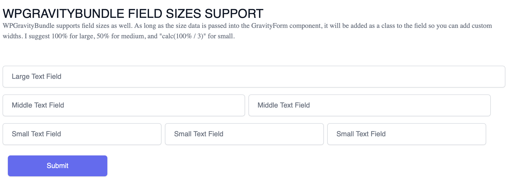

# WPGravityBundle

Headless WordPress is the future of WordPress, and WPGraphQL is at it's helm. With `WPGraphQL for Gravity Forms`, you can harness the power of Gravity Forms for your headless website. This package is built to complement the work done by AxePress Development by giving you a React Component and a hook that will handle your form data and assemble your submission mutation for you.

## Installation

To install this package simply run

`npm install wpgravitybundle`

The following system is recommended:
- PHP 7.4-8.1+
- WordPress 5.4.1+
- WPGraphQL 1.9.0+
- Gravity Forms 2.5+ (Recommend: v2.6+)
- WPGraphQL for Gravity Forms 0.12.3
- WPGraphQL Upload - used for File Upload

Technically, this package simply needs data in JSON format so the above is not necessary. However, the shape of this data is dependant upon the shape that `WPGraphQL for Gravity Forms` gives you for your data and expects upon form submission.

## Use

To use this package, import the form component and the hook.
The GravityForm component needs two props: form and onSubmit.
Since this package is built to use with `WPGraphQL for Gravity Forms` WordPress plugin by AxePress Development, it expects a specific json object for each field.
`form` should be the data.wpGfForm object you receive from your query.
The `onSubmit` prop is expecting a function.

Internally, the package will map through your fields, display them, and handle state and validation.
The form values are passed into your onSubmit function when the form is submitted.
They are already preformatted so that all you need to do is pass the values into your mutation as an variable.

The `useGravityFormMutation` hook needs your form data as well. It will use the form data to create the necessary GraphQL Mutation to submit the user's input. Just assign it a name and plug it into your preferred GraphQL client.

Example Use:

``` ts
import React from 'react'
import { graphql } from 'gatsby'
import { useMutation } from "urql"
import Parser from 'html-react-parser'
import GravityForm, { useGravityFormMutation } from "wpgravitybundle"

export default function Example({ data }) {
  const form = data.wpGfForm
  const buttonClass = "btn-primary"
  const captchaSiteKey = process.env.GOOGLE_INVISIBLE_CAPTCHA_SITE_KEY
  const captchaSecretKey = process.env.GOODLE_INVISIBLE_CAPTCHA_SECRET_KEY

  const validation = [
    {
      id: 5, // id of the form field.
      regex: /[0-9]+/g, // regex you would like to validate the field with.
      message: "I don't like letters! Only numbers." // error message displayed if validation fails.
    }
  ]
  const captcha = { 
    captchaSiteKey, 
    captchaSecretKey,
    type: "Invisible" // options are "Invisible" and "Checkbox".
  }

  const gravityFormMutation = useGravityFormMutation(form)
  const SubmitForm = `${gravityFormMutation}`

  const [{ data, fetching, error }, submitForm] = useMutation(SubmitForm)

  const handleSubmit = (values: any) => {
    return submitForm(values)
  }

  if (fetching) {
    return <p>Loading... </p>
  }

  if (error) {
    return <p>There was an error submitting the form: {error.message}</p>
  }

  if (data) {
    return <p>Confirmation message here!</p>
  }

  return (
    <>
      {form && (
        <>
          <GravityForm
            form={form} // necessary
            onSubmit={handleSubmit} // necessary
            buttonClass={buttonClass} // optional
            validation={validation} // optional. For custom field value validation.
            captcha={captcha} // necessary if you are using a Captcha field.
            parser={Parser} // necessary if you are using an HTML field.
            debug={true} // will console.log form state to help you debug issues.
          />
        </>
      )}
    </>
  )
}

export const query = graphql`
  query {
      wpGfForm(databaseId: {eq: 1}) {
        id
        databaseId
        cssClass
        formFields {
          nodes {
            ... on WpTextField {
              id
              type
              cssClass
              isRequired
              label
              pageNumber
              placeholder
              size
            }
          }
        }
        submitButton {
          text
          type
        }
      }
    }
  `
```

## Styling

Admittedly, more work could be done to make styling easier and this is something we want to do for future releases.
For now, the easiest way is to take advantage of `cssClass`. You can query for `cssClass` on the form and for every form field.
Each form field is wrapped in a `<div className={`${cssClass}`}>`. Certain fields have the cssClass set on the fieldset element instead.

## Demos

Check out https://WPGravityBundle.com to see it in action.



## Inspiration

This package was inspired by the work of Kellen Mace (https://twitter.com/kellenmace) of WP Engine and his public Github repository: https://github.com/kellenmace/gravity-forms-in-headless-wordpress-gatsby.

## Say Thank You

If you enjoy using WPGravityBundle and want to say thank you, you can buy me a coffee:

<a href="https://www.buymeacoffee.com/mosesintech" target="_blank"></a>

## About the Author.

I love WordPress and React.
I have been working with WordPress for 15 years, and React/Node for 4.
Headless WordPress is definitely a passion of mine, and I love looking for opportunities to contribute whenever I can.
If you have a WordPress/React project you'd like a hand with, please reach out to me at moses@totalityworks.com!